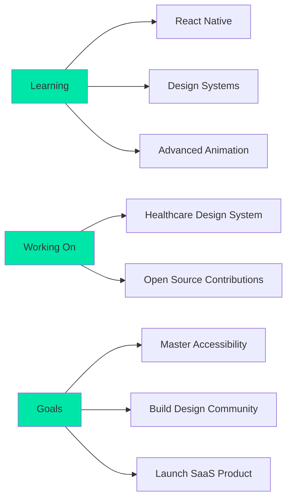

<p align="center">
  
</p>

<p align="center">
  
</p>

<p align="center">
  
  
  
</p>

<p align="center">
  <a href="https://www.linkedin.com/in/chamudi-kaushalya">
    
  </a>
  <a href="mailto:chamudikaushalya@gmail.com">
    
  </a>
  <a href="https://twitter.com/chamuXk">
    
  </a>
  <a href="https://www.behance.net/chamudikaushalya">
    
  </a>
  <a href="https://dribbble.com/chamuXk">
    
  </a>
</p>

<br/>


## 👋 About Me

```typescript
const chamudi = {
    role: "UI/UX Designer & Frontend Developer",
    education: "Software Engineering Undergraduate",
    location: "Kandy, Sri Lanka 🇱🇰",
    
    currentFocus: {
        learning: ["React Native", "Advanced Figma", "Design Systems"],
        working: "Healthcare Design System",
        interests: ["Accessible Design", "User Psychology", "Animation"]
    },
    
    philosophy: "Design is not just what it looks like,
                 design is how it works. - Steve Jobs",
    
    dailyRoutine: ["☕ Coffee", "💻 Code", "🎨 Design", "🔁 Repeat"]
};
```

<br/>

### 🎯 What I Do

- 🎨 **Design** intuitive and beautiful user interfaces
- 💻 **Develop** responsive and performant web applications  
- 🔍 **Research** user needs and pain points
- 🚀 **Transform** ideas into pixel-perfect implementations
- 🤝 **Collaborate** with teams to deliver exceptional experiences

---

## 🛠️ Tech Arsenal

<details open>
<summary><b>🎨 Design & Prototyping</b></summary>
<br/>


</details>

<details open>
<summary><b>💻 Frontend Development</b></summary>
<br/>


</details>

<details open>
<summary><b>🔧 Backend & Tools</b></summary>
<br/>


</details>

---

## 📊 GitHub Statistics

<div align="center">
  
  
  
  
  
  
  
  
  
</div>

<br/>

<p align="center">
  
</p>

---

## 🚀 Featured Projects

<div align="center">

<table>
<tr>
<td width="50%">

### 🩺 Doctor Roster System
<a href="https://github.com/chamuXk/doctor-roster-system">
  
</a>

**An efficient scheduling system for managing doctors' duties with an intuitive UI**

`HTML` `CSS` `JavaScript` `PHP` `MySQL`

</td>
<td width="50%">

### 🎨 UI Component Library
<a href="https://github.com/chamuXk/ui-component-library">
  
</a>

**Reusable components focused on accessibility and consistency**

`React` `TypeScript` `Tailwind` `Storybook`

</td>
</tr>

<tr>
<td width="50%">

### 📱 E-Commerce App Design
<a href="https://www.behance.net/gallery/your-project">
  
</a>

**Complete mobile app design with 50+ screens and interactive prototype**

`Figma` `Adobe XD` `ProtoPie`

</td>
<td width="50%">

### 🌐 Portfolio Website
<a href="https://github.com/chamuXk/portfolio">
  
</a>

**Personal portfolio showcasing design and development work**

`Next.js` `Tailwind CSS` `Framer Motion`

</td>
</tr>
</table>

</div>

---

## 💡 Current Focus & Goals



### 🎯 2024 Goals
- ✅ Master React and TypeScript
- 🔄 Build and launch 3 major projects
- 🔄 Contribute to 10+ open source projects
- 📝 Start a design/dev blog
- 🎨 Create a comprehensive design system
- 🤝 Collaborate with international teams

---

## 📈 Weekly Development Breakdown

<!--START_SECTION:waka-->
```text
TypeScript   8 hrs 42 mins   ████████████░░░░░░░░░   48.2%
React        5 hrs 15 mins   ████████░░░░░░░░░░░░░   29.1%
CSS          2 hrs 30 mins   ███░░░░░░░░░░░░░░░░░░   13.9%
HTML         1 hr 15 mins    ██░░░░░░░░░░░░░░░░░░░    6.9%
JSON         20 mins         ░░░░░░░░░░░░░░░░░░░░░    1.9%
```
<!--END_SECTION:waka-->

---

## 🎵 Vibing To

<p align="center">
  <a href="https://spotify-github-profile.kittinanx.com/api/view?uid=31q4d4y6b5omlou6z2qhbpqsqgya&redirect=true">
    
  </a>
</p>

---

## 🏆 Achievements & Highlights

<p align="center">
  
</p>

### 🌟 Highlights
- 🎨 **100+** UI/UX projects completed
- 💻 **50+** repositories on GitHub
- 🤝 Collaborated on **20+** team projects
- 📱 Designed **500+** screens across various platforms
- ⭐ Can identify **100+** typefaces by sight
- 🎓 Mentored **10+** junior designers

---

## 💭 Random Dev Quote

<p align="center">
  
</p>

---

## 🤝 Let's Connect & Collaborate!

<p align="center">
  <a href="https://linkedin.com/in/chamudi-kaushalya">
    
  </a>
  <a href="mailto:chamudikaushalya@gmail.com">
    
  </a>
  <a href="https://twitter.com/chamuXk">
    
  </a>
  <a href="https://www.behance.net/chamudikaushalya">
    
  </a>
  <a href="https://dribbble.com/chamuXk">
    
  </a>
  <a href="https://www.figma.com/@chamuxk">
    
  </a>
  <a href="https://discord.com/users/your-discord-id">
    
  </a>
</p>

<p align="center">
  
</p>

<p align="center">
  
</p>

<div align="center">

### 💚 Show some love by starring repositories you like!


</div>

---

<p align="center">
  <i>⭐️ From <a href="https://github.com/chamuXk">chamuXk</a> with 💚</i>
</p>
